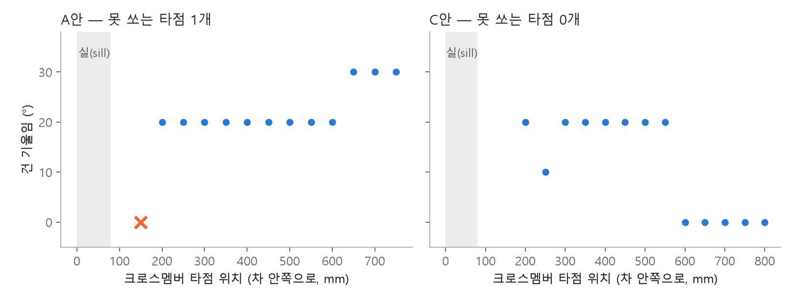
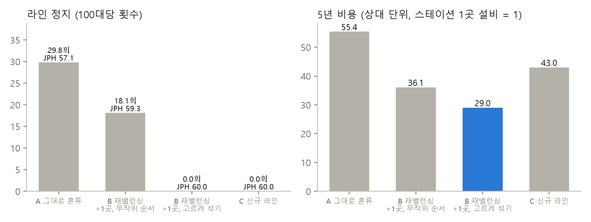

# 신차 투입 검토 시뮬레이터

신차가 들어올 때 **차체 구조 → 용접 로봇 사양 → 라인 공법 → 투자비**를 데이터로 검토하는 작은 CPS.

- 1단계 선행구조 검토: 차체 하위 조립품의 스폿 용접 타점마다 로봇이 닿는지, 건·팔이 부딪히는지, 몇 초 걸리는지 판정 → 로봇 배정·대수 → 설계안 비교
- 2단계 혼류 투입 검토: 기존 라인에 신차를 섞을 때 그대로 / 재밸런싱+증설 / 신규 라인을 스테이션 수·라인 정지·5년 비용으로 비교

## 결과 (2026-09-28)

**1단계 — 설계안 3개, 타점 75개, KUKA KR210 L150 후보 위치 4곳**

| 설계안 | 못 쏘는 타점 | 건 기울임 타점 | 로봇 (JPH 60) | 로봇 (JPH 65~80) |
|---|---|---|---|---|
| A 기준 (크로스멤버 플랜지 15 mm) | 1 | 12 | 2 | 3 |
| B 플랜지만 30 mm | 1 | 12 | 2 | 3 |
| C B + 첫 타점 50 mm 안쪽으로 | **0** | 8 | 2 | 3 |

플랜지를 넓히는 것으로는 풀리지 않았다. 못 쏘던 타점은 실(sill) 안쪽 벽에 붙어 건 몸체가 벽에 걸리는 자리였고, 첫 타점 위치를 옮기자 풀렸다.



**2단계 — 기존 라인 83작업(ARC83), 목표 JPH 60, 신차 비율 30 %**

| 대안 | 스테이션 | 100대당 라인 정지 | 실제 JPH | 5년 비용 (상대) |
|---|---|---|---|---|
| A 그대로 혼류 (무작위 / 고르게) | 13 | 29.8 / 30.0 | 57.1 / 57.1 | 55.4 / 54.6 |
| B 재밸런싱 +1곳, 무작위 순서 | 14 | 18.1 | 59.3 | 36.1 |
| **B 재밸런싱 +1곳, 고르게 섞기** | 14 | **0** | **60.0** | **29.0** |
| C 신규 라인 (기존 9 + 신규 5) | 14 | 0 | 60.0 | 43.0 |

- 순서 규칙(신차를 고르게 섞기)은 **재밸런싱 뒤에만** 효과가 있다. 기존 라인은 효율 97 %라 여유가 없어서, 순서만 바꾼 A는 그대로다.
- 신차 작업시간 가정(시드)을 10가지로 바꿔도 추천안은 10/10 B+고르게. B의 증설은 매번 1곳, 정지는 10/10 에서 0 (`results/stage2_seeds.json`).
- A 가 B 보다 싸려면 "스테이션 1곳의 5년 비용 > 못 만든 차 약 1.9만 대의 이익"이어야 한다(A는 5년에 약 5.7만 대를 잃는다).
- 1단계와 연결: 차체 A안은 못 쏘는 타점 때문에 수동 보완 공정이 붙어 32.0, C안은 29.0.



## 무엇이 진짜고 무엇이 가정인가

| 진짜 (공개 자료) | 가정 |
|---|---|
| 로봇 기구학·관절 한계·속도: ROS-Industrial `kuka_experimental` KR210 L150 (`data/robot/`) | 차체 형상(단순화한 실·B필러·크로스멤버) |
| 기존 라인 작업·선후관계: Scholl(1993) SALBP 벤치마크 ARC83 | 용접건 치수, 타점당 0.7 s, 이송·클램프 15 s |
| 라인밸런싱 풀이기: 공개 최적해와 대조 (아래) | 신차 작업시간 = 기존 × 로그정규(평균 1.15) |
|  | 여유창 20 %, 비용 단가(상대 단위) |

실제 기아 데이터는 쓰지 않았다. 가정은 모두 `src/stage1.py`, `src/stage2.py` 맨 위 한 곳에 있다.

## 검증

- 라인밸런싱(CP-SAT): 공개 최적해 12문제 중 11 일치 (ARC83 4/4, Hahn 4/4, Warnecke 3/4 — c=56 은 30 초 제한에서 30, 최적 29)
- `pytest tests` 9개: 역기구학 도달/실패, 건 간섭, 기울여 피하기, 벤치마크 최적해, 정지 시뮬레이션 손계산

## 돌리기

```
python -m venv .venv && .venv\Scripts\pip install ortools ikpy numpy matplotlib openpyxl pytest
.venv\Scripts\python src\stage1.py      # results/stage1*.json, stage1_spots.csv
.venv\Scripts\python src\stage2.py      # results/stage2.json
cd src && ..\.venv\Scripts\python figures.py
.venv\Scripts\python -m pytest -q tests
```

## 한계

- 로봇끼리의 간섭, 지그·클램프 형상, 오프라인 프로그래밍 경로는 보지 않는다.
- 사이클타임은 관절 최대속도 × 가감속 보정의 근사다.
- 비용은 상대 단위다. 결론은 "어느 단가에서 뒤집히는가"로 읽는다.
