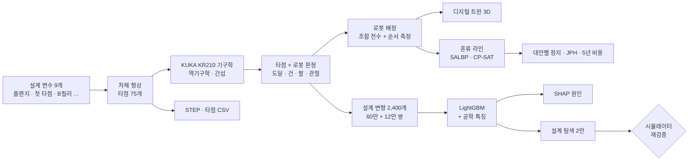

# 🚗 biw-weld-twin

차체 스폿 용접 공정 디지털 트윈 + AI 제조성 판정
신차 구조 검토 · 로봇 대수 · 설계 기준 · 혼류 투입 · STEP 내보내기


<sub>설계안 A · KUKA KR210 2대가 계산된 순서대로 타점 75개를 용접 · 끝에서 못 쏘는 타점 M00 선택 → 건 간섭</sub>

## 요약

- 🤖 로봇: KUKA KR210 L150 실제 기구학 (ROS-Industrial) · 역기구학 · 용접건/팔 간섭 · 사이클타임
- 🔩 차체: 사이드 실 · B필러 · 크로스멤버 하위 조립품 · 스폿 타점 75개 · 설계 변수 9개
- 🧮 로봇 대수: 후보 위치 조합 전수 + 실제 용접 순서 측정 · JPH 60 → 2대 · 65~75 → 3대 · 80 → 4대
- 🔍 설계 문제: 첫 타점이 실 벽에 붙어 건 간섭 · 플랜지 확대는 효과 없음 · 첫 타점 이동으로 해결
- 🧠 AI 제조성 판정: 처음 보는 설계 400개 · 못 쏘는 타점 재현율 96.3 % · 설계 판정 98.3 % · 0.03 s (시뮬레이터 4.2 s)
- 🗺️ AI 설계 탐색: 2만 안 8분 · 추천 20안 시뮬레이터 재검증 20/20 · 설계 기준 "첫 타점 ≥ 실 안쪽 면 120 mm"
- 🏭 혼류 투입: 그대로 투입 100대당 정지 29.8회 → 재밸런싱 +1 스테이션 + 고르게 섞기 0회 · 신규 라인보다 5년 비용 −33 %
- 🖥️ 디지털 트윈: CAD 도구형 3D 화면 · 브라우저 안 AI 판정 (파이썬과 불일치 0/2,325)
- 📐 CAD: 설계안별 STEP + 타점 목록 CSV (좌표 · 법선 · 판정 · 담당 로봇)

## 데모

| AI 설계 검토 | 혼류 라인 |
|---|---|
|  |  |
| 첫 타점 거리 0 → 120 mm · 못 쏘는 타점 2 → 1 → 0 | A 그대로 투입 (정지) vs B 재밸런싱 (정지 0) |

- 고화질 영상: [`docs/media/demo_weld.mp4`](docs/media/demo_weld.mp4)
- 실행: `open_viewer.cmd` (로컬 서버 + 브라우저)
- 화면: 메뉴 · 도구 막대 · 장면 트리 · 속성 · 타임라인 / 혼류 라인 / 로그 도크 · 상태 막대

## 처리 흐름



## 1 · 선행구조 검토

| 설계안 | 변경 | 못 쏘는 타점 | 로봇 (JPH 60) | 가장 바쁜 로봇 (예산 45 s) |
|---|---|---|---|---|
| A 기준 | 플랜지 15 mm · 첫 타점 30 mm | 1 (M00) | 2 | 43.7 s |
| B | 플랜지만 30 mm | 1 (M00) | 2 | 44.1 s |
| **C** | B + 첫 타점 80 mm | **0** | 2 | 45.0 s |


<sub>그림 1. (a) 목표 JPH 별 필요 로봇 — 세 설계안 같음 (b) 가장 바쁜 로봇 사이클과 예산 (택트 − 이송·클램프 15 s)</sub>

- M00 판정: 로봇 4대 모두 건 간섭 → 건 몸체가 실 안쪽 벽에 걸림
- 로봇 배정: 조합 전수 → 균형 배정 (CP-SAT) → 관절 공간 최근접 순서로 실측 → 초과 시 타점 옮기기
- 처음 쓴 "예산 줄여 가며 재배정" 방식 → A 를 3대로 과대 산정 → 조합 전수로 2대 확인

## 2 · AI 제조성 판정


<sub>그림 2. (a) 학습에 없던 설계 400개 시험 — 좌표만 vs 공학 특징 추가 (b) '못 쏜다' 판정을 민 특징 (SHAP)</sub>

| 지표 (시험 400 설계) | 좌표만 | + 공학 특징 |
|---|---|---|
| 못 쏘는 타점 재현율 | 96.3 % | **96.3 %** |
| 못 쏘는 타점 정밀도 | 69.7 % | **86.3 %** |
| 설계 문제 여부 판정 | 92.3 % | **98.3 %** |
| 못 쏘는 타점 수 정확 | 81.8 % | **90.5 %** |
| 설계 1개 판정 | | **0.03 s** (시뮬레이터 4.2 s) |

- 데이터: 설계 변수 9개 무작위 · 학습 2,000 설계 (60만 쌍) · 시험 400 설계 (12만 쌍)
- 공학 특징 7개: 로봇 어깨 → 건 경로와 B필러 · 실 여유, 건 몸체와 실 · 벽 여유 …
- 임계값: 검증 설계에서 못 쏘는 타점 재현율 ≥ 95 % (놓치는 쪽이 더 비쌈)
- SHAP 상위: 크로스멤버 타점 · 팔 경로–B필러 여유 · 로봇 거리 → B필러 뒤 크로스멤버 · 실 옆 첫 타점


<sub>그림 3. (a) AI 제조성 지도 — 색 = AI 예측 못 쏘는 타점, 점 = 시뮬레이터 확인 64개 (전부 일치) (b) 첫 타점 거리 5 mm 간격 31점 — 화살표 = 불일치 2점, 둘 다 AI 가 더 나쁘게 본 쪽</sub>

- 플랜지 폭: 영향 없음
- 첫 타점: 구간 시작에서 80 mm 이상 (실 안쪽 면에서 120 mm 이상) → 0개
- 경계 근처: AI 보수적 → AI 1차 선별 + 시뮬레이터 확정 2단 구조
- 설계 탐색: 기준 A 주변 20,000 안 · AI 8분 (시뮬레이터 9코어 약 3.5시간) · 통과 3,414 · A 에서 가장 적게 바꾼 20안 재검증 20/20

## 3 · 혼류 투입 검토


<sub>그림 4. 기존 라인 (ARC83 · 83작업 · 13 스테이션 · 효율 97 %) 에 신차 30 % 투입 — (a) 100대당 라인 정지 (b) 5년 비용 (스테이션 1곳 설비 = 1)</sub>

| 대안 | 스테이션 | 정지 / 100대 | 실제 JPH | 5년 비용 |
|---|---|---|---|---|
| A 그대로 (무작위 / 고르게) | 13 | 29.8 / 30.0 | 57.1 / 57.1 | 55.4 / 54.6 |
| B 재밸런싱 +1, 무작위 순서 | 14 | 18.1 | 59.3 | 36.1 |
| **B 재밸런싱 +1, 고르게 섞기** | 14 | **0** | **60.0** | **29.0** |
| C 신규 라인 (9 + 5) | 14 | 0 | 60.0 | 43.0 |

- 순서 규칙 효과: 재밸런싱 뒤에만 (A 는 여유 없음)
- 신차 작업시간 가정 10가지: 추천안 10/10 같음 · 증설 매번 1곳 · 정지 0
- 뒤집히는 조건: 스테이션 1곳 5년 비용 > 못 만든 차 약 1.9만 대 이익일 때만 A (A 손실 5년 약 5.7만 대)
- 차체 설계 연결: A · B안 수동 보완 공정 추가 32.0 · C안 29.0

## 4 · 디지털 트윈 도구

<table>
<tr><td></td><td></td></tr>
<tr><td><sub>설계안 A · M00 선택 · 속성 창에 건 간섭</sub></td><td><sub>AI 설계 검토 · 첫 타점 25 mm → M00 · M01</sub></td></tr>
</table>

- 3D: KUKA 실제 외형 메시 · 파이썬 역기구학 관절각 재생 · 전극 끝–타점 오차 최대 0.000004 mm
- AI: LightGBM 530 트리 → 브라우저 JSON (1.2 MB) · 특징 계산 JS 이식 · 파이썬 대조 31 설계 불일치 0
- 도크: 장면 트리 (숨기기 · 선택) · 속성 · 타임라인 (용접 눈금) · 혼류 라인 · 로그 · 상태 막대
- 좁은 화면: 도크 → 서랍 · 400 px 가로 스크롤 없음

## 5 · CAD 내보내기

- `results/cad/{A,B,C}.step` — 부품 4 (SIDE_SILL · B_PILLAR · CROSSMEMBER_WALL · FLOOR) + 타점 구 75개
- `results/cad/{A,B,C}_spots.csv` — id · 부위 · 좌표 mm · 법선 · OK/NG · 담당 로봇 · 못 쏘는 이유
- 검증: STEP 다시 읽기 → 솔리드 79개 · 경계 2400 × 1013 × 1153 mm

## 진짜 vs 가정

| 공개 자료 | 가정 |
|---|---|
| 로봇 기구학 · 관절 한계 · 속도 · 외형 — ROS-Industrial `kuka_experimental` | 차체 형상 (단순화) · 설계 변수 범위 |
| 기존 라인 작업 · 선후관계 — Scholl (1993) SALBP ARC83 | 용접건 치수 · 타점당 0.7 s · 이송 · 클램프 15 s |
| 라인밸런싱 풀이기 — 공개 최적해와 대조 | 신차 작업시간 배수 · 여유창 20 % · 비용 (상대 단위) |

- 실제 완성차 공장 데이터 없음 · 가정은 `src/stage1.py` · `stage2.py` · `dataset.py` 맨 위

## 검증

- ✅ 라인밸런싱 CP-SAT: 공개 최적해 12문제 중 11 (ARC83 4/4 · Hahn 4/4 · Warnecke 3/4, c=56 은 30 s 제한 → 30 vs 29)
- ✅ AI: 분리한 시험 400 설계 · 지도 64/64 · 경계 29/31 · 탐색 20/20
- ✅ 3D ↔ 파이썬: 역기구학 좌표 · AI 확률 (최대 차 5e-7)
- ✅ CAD: STEP 재읽기 솔리드 수 · 경계
- ✅ `pytest` 13개: 역기구학 · 간섭 · 기울여 피하기 · 벤치마크 최적해 · 라인 정지 손계산 · 로봇 배정 · AI 특징 순서 · AI 판정 방향

<details>
<summary>📁 폴더 · 돌리기</summary>

```
src/        robot · body · reach (판정) · stage1 (배정) · stage2 (혼류) · dataset · surrogate · explore (AI) · export_twin · export_cad
viewer/     three.js 디지털 트윈 (index.html · app.js · ai.js · ai/trees.json · meshes/)
results/    결과 JSON · STEP · 타점 CSV
docs/       README 그림 · 데모 영상
scripts/    README 그림 생성
tests/      pytest
```

```
python -m venv .venv && .venv\Scripts\pip install -r requirements.txt
.venv\Scripts\python src\fetch_data.py         # SALBP 벤치마크 (저장소에 없음)
cd src
..\.venv\Scripts\python stage1.py              # 설계안 A/B/C · JPH 별 로봇 대수
..\.venv\Scripts\python stage2.py              # 혼류 대안
..\.venv\Scripts\python dataset.py 2000 9 0 && ..\.venv\Scripts\python dataset.py 400 9 1   # 약 20분
..\.venv\Scripts\python surrogate.py           # AI 학습 · 시험
..\.venv\Scripts\python explore.py             # 지도 · 탐색 · 재검증 (약 10분)
..\.venv\Scripts\python export_twin.py && ..\.venv\Scripts\python export_cad.py
cd .. && .venv\Scripts\python scripts\make_readme_figures.py
```
</details>

<details>
<summary>⚠️ 한계</summary>

- 로봇끼리 간섭 · 지그 · 클램프 · 이동 경로 중간 간섭 미포함 (타점 자세만)
- 사이클타임: 관절 최대속도 × 가감속 보정 근사
- 차체: 하위 조립품 1개 단순화 · AI 는 이 설계 공간 안에서만 검증
- 비용: 상대 단위 → "어느 단가에서 뒤집히는가" 로 읽기
</details>

<details>
<summary>📜 출처 · 라이선스</summary>

- 외부 자료: `NOTICE.md` (KUKA 모델 Apache-2.0 · SALBP 원 사이트 · three.js MIT)
- 코드: MIT
- 계획 대비 실제: `PLAN.md`
</details>
