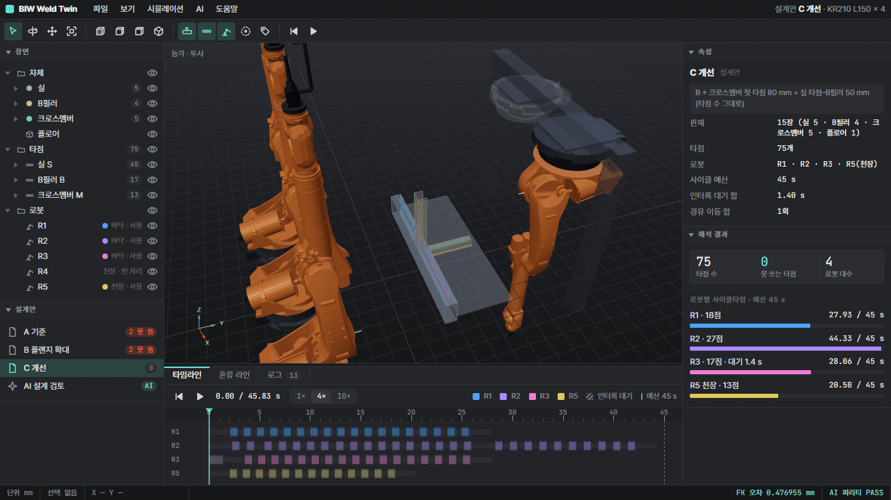
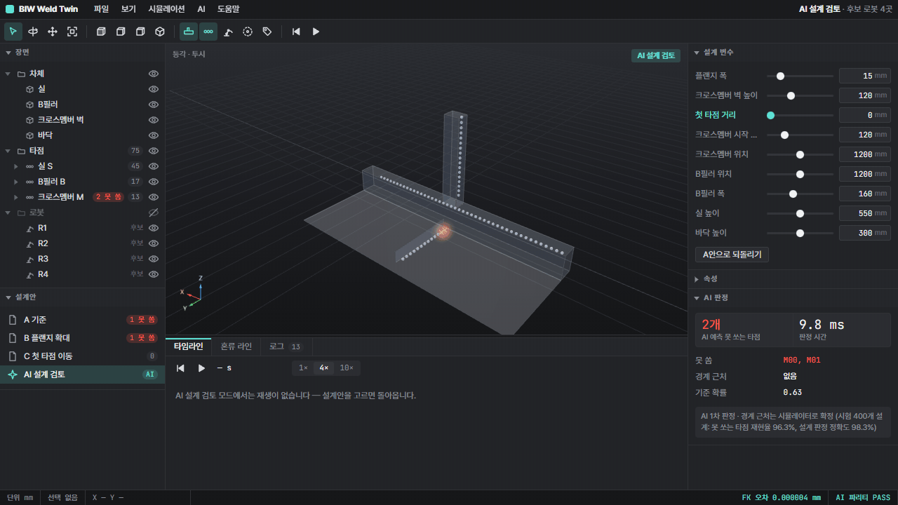
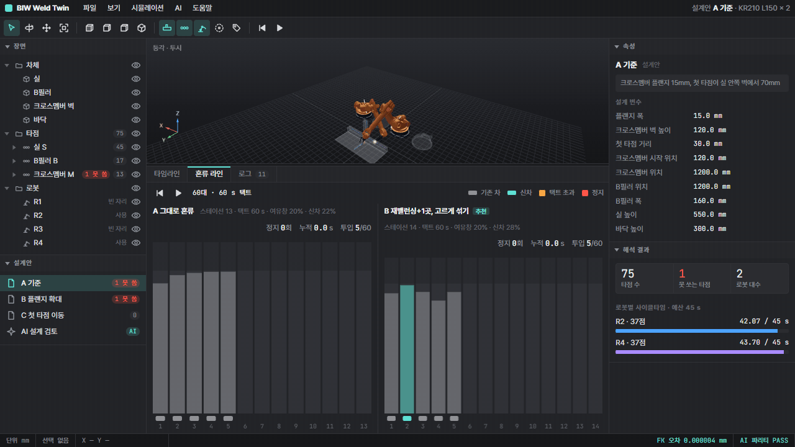
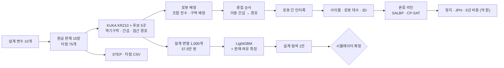
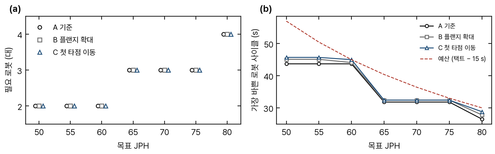
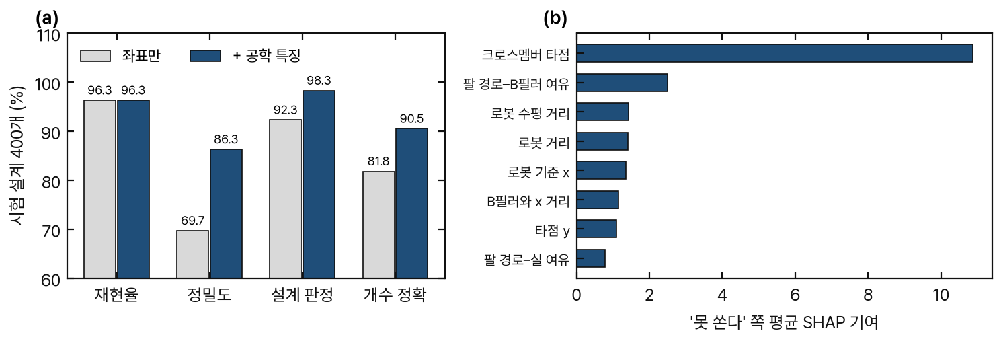
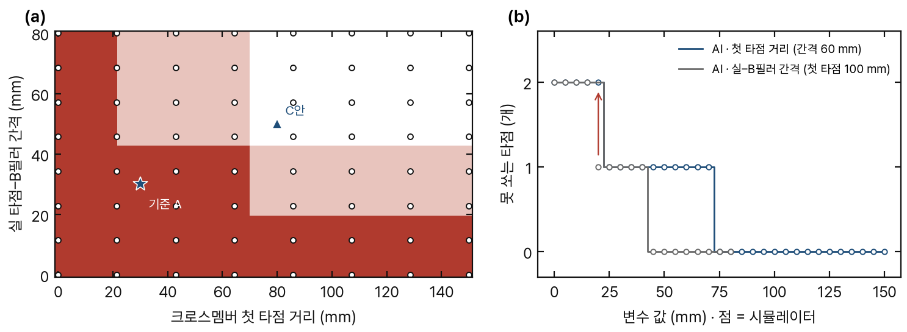
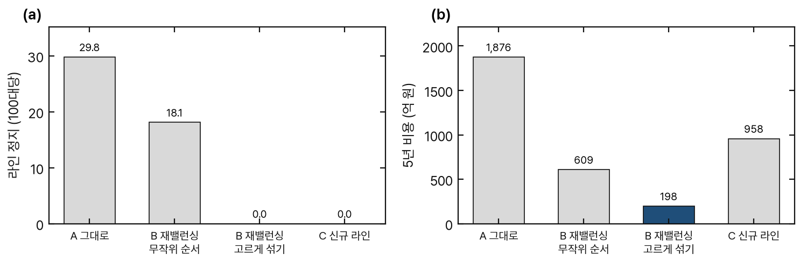
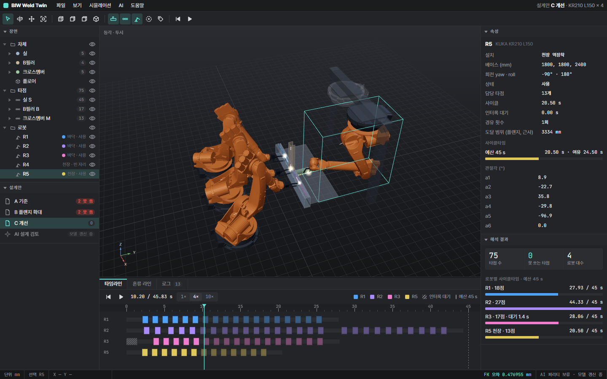
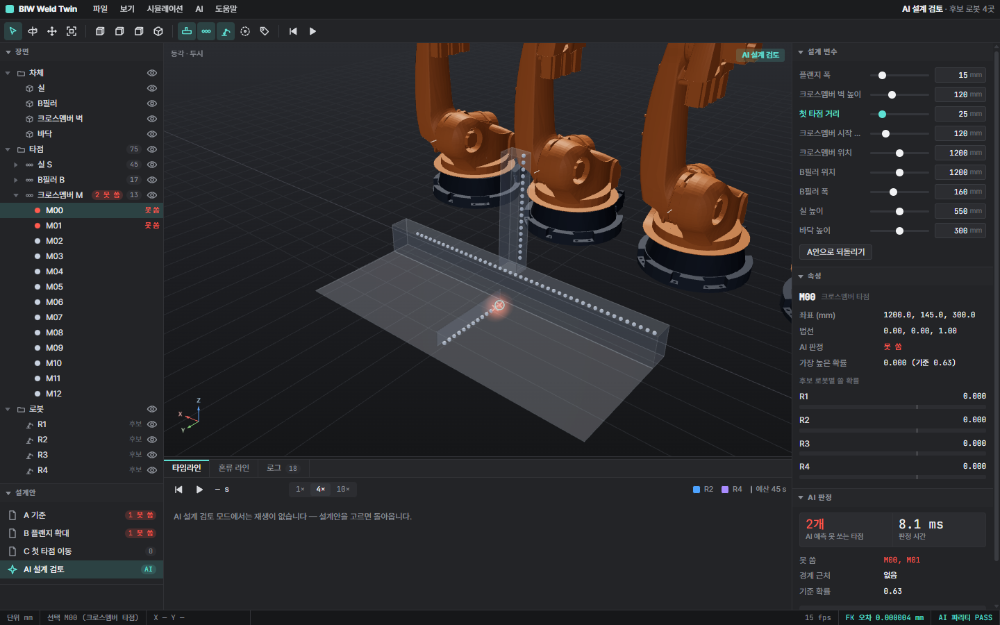

# Digital Twin and Surrogate-Based Manufacturability Assessment for Body-in-White Spot Welding

차체 스폿 용접 공정 디지털 트윈 + AI 제조성 판정 — 신차 구조 검토 · 로봇 배치 · 경로 · 로봇 간 간섭 · 설계 기준 · 혼류 투입 · 투자비 · STEP

Haejyn · 기술 보고서 · 2026



<sub>그림 0. 설계안 C. 바닥 로봇 3대(실 · B필러)와 천장 로봇 1대(크로스멤버)가 계산된 순서대로 타점 75개를 용접한다. 접근 · 후퇴 경로와 인터록 대기를 포함한다 ([MP4](docs/media/demo_weld.mp4)).</sub>

## Introduction

신차 차체 구조가 기존 스폿 용접 라인에서 생산 가능한지를 설계 단계에서 판단하기 위한 디지털 트윈을 구성하였다. 판금 모자형 단면 판재 15장(두께 1.2 mm)과 플랜지 위 스폿 타점 75개로 이루어진 하위 조립품에 대해, KUKA KR210 L150 의 실제 기구학으로 역기구학 · 건/팔 간섭 · 접근 · 후퇴 경로 · 로봇 간 인터록을 계산하고 목표 JPH 별 로봇 대수와 사이클을 산출한다. 전체 시뮬레이션(약 3분)을 대신하는 LightGBM 대리 모델은 학습에 없던 설계 200개에서 못 쏘는 타점 재현율 99.9 %, 정밀도 100 %를 0.05 초에 판정한다. 아울러 기존 라인에 신차를 혼류 투입할 때의 라인 정지와 5년 비용을 공개 단가로 비교하고, 설계안별 STEP 을 내보낸다.

## Main Results

| 항목 | 결과 |
|---|---|
| 로봇 대수 | JPH 50 → 3대 · JPH 60 → 4대 (병목 B필러 로봇 44.3 / 45 s) · JPH 70 → 후보 5곳으로 불가 |
| 설계 문제 | S23 (B필러 뒤 플랜지에 붙은 실 타점) · M00 (실 벽에 붙은 크로스멤버 첫 타점) → 건 간섭, 플랜지 확대로 해결되지 않음 |
| AI 제조성 판정 | 처음 보는 설계 200개 · 못 쏘는 타점 재현율 99.9 % · 정밀도 100 % · 설계 판정 99.5 % · 0.05 s |
| 설계 기준 | 첫 타점 ≥ 75 mm · 실–B필러 간격 ≥ 45 mm → 못 쏘는 타점 0개 · 추천 20안 시뮬레이터 재검증 18/20 |
| 혼류 투입 | 그대로 투입 5년 1,830억 원 → 재밸런싱 +1 스테이션 + 고르게 섞기 198억 원 (432 조합 모두 같은 결론) |
| 디지털 트윈 | CAD 도구형 3D · 브라우저 내 AI 판정 (파이썬과 불일치 0 / 2,325) |
| CAD | 설계안별 STEP (판재 15 + 타점 75) + 타점 목록 CSV |

| AI 설계 검토 | 혼류 라인 |
|---|---|
|  |  |
| 첫 타점 거리 0 → 120 mm, 실–B필러 간격 30 → 60 mm 에 따라 못 쏘는 타점 3 → 2 → 1 → 0 | A 그대로 투입 (정지) vs B 재밸런싱 (정지 0) |

## Method



- **로봇:** 후보 5곳 (바닥 3 + 천장 역설치 2) · 역기구학 · 건/팔 간섭 · 접근 · 후퇴 150 mm 경로
- **경로 · 로봇 간:** 타점 사이 이동 간섭 시 대기 자세 경유 · 로봇 간 우선순위 + 구역 예약 인터록
- **AI:** LightGBM + 판재 여유 특징 · SHAP · 라벨 = 시뮬레이터
- **라인:** SALBP 라인밸런싱 · OR-Tools CP-SAT

## 1. Preliminary Structure Review

| 설계안 | 변경 | 못 쏘는 타점 | 로봇 (JPH 60) | 가장 바쁜 로봇 | 인터록 대기 |
|---|---|---|---|---|---|
| A 기준 | 플랜지 15 · 첫 타점 30 · 실–B필러 30 mm | 2 (S23 · M00) | 4 | 44.3 s | 0 |
| B | 플랜지만 30 mm | 2 (그대로) | 4 | 44.3 s | 0 |
| **C 개선** | B + 첫 타점 80 · 실–B필러 50 mm | **0** | 4 | 44.3 s | R3 1.4 s |


<sub>그림 1. (a) 목표 JPH 별 필요 로봇 (✕ = 후보 5곳으로 불가) (b) 가장 바쁜 로봇 사이클과 예산 (택트 − 이송 · 클램프 15 s)</sub>

- 판정: 타점 × 로봇마다 기울임 0 / 10 / 20 / 30° × (용접 자세 + 접근 경로 3점) 역기구학 · 관절 한계 · 건 3토막 · 팔 5토막 캡슐 간섭
- 배정: 조합 전수 → 구역 배정 (가깝고 법선 쪽 로봇) → 관절 공간 최근접 순서 → 이동 경로 간섭 시 대기 자세 경유 → 로봇 간 인터록
- 사이클: 타점당 약 1.5 s (접근 · 용접 0.7 s · 후퇴 · 이동) · 병목 = B필러 구역 로봇 27점
- JPH 70: B필러 구역에 로봇 위치를 추가해야 하며, 배치 설계 과제로 남긴다.

**배치 · 인터록 결정 근거 (기각된 대안)**

| 초기 안 | 문제 | 채택 |
|---|---|---|
| 로봇 0.8 m 간격 | 받침대 겹침 | 1.3 m |
| 예산을 줄여 가며 재배정 | 로봇 1대 과대 산정 | 조합 전수 |
| 타점 수 균형 배정 | 이웃 로봇이 서로 구역에 팔을 뻗어 시간의 24~34 % 겹침 | 구역 배정 |
| 바깥쪽 한 줄 4곳 | 두 곳은 일이 없음 | 바깥 3 + 천장 2 (천장 바로 아래는 닿지 않아 중심선 너머로 비켜 설치) |
| 동시 진행 인터록 / 전체 경로 예약 | 교착 / 대기 과다 | 우선순위 + 남은 경로 예약 + 복수 우선순위 중 최선 |
| 손목 a6 자유 | 타점마다 200~320° 회전, 타점당 4.8 s | 건 축 대칭이므로 a6 = 0 고정 → 1.5 s |

## 2. Surrogate Manufacturability Assessment


<sub>그림 2. (a) 학습에 없던 설계 200개 시험 — 좌표만 vs 판재 여유 특징 추가 (b) '못 쏜다' 판정에 기여한 특징 (SHAP)</sub>

| 지표 (시험 200 설계) | 좌표만 | 특징 첫 판 | **특징 수정 후** |
|---|---|---|---|
| 못 쏘는 타점 재현율 | 99.4 % | 97.9 % | **99.9 %** |
| 못 쏘는 타점 정밀도 | 80.6 % | 93.4 % | **100 %** |
| 설계 문제 여부 판정 | 98.0 % | 98.0 % | **99.5 %** |
| 못 쏘는 타점 수 정확 | 54.0 % | 91.5 % | **99.5 %** |
| 설계 1개 판정 시간 | | | **0.05 s** (시뮬레이터: 판정만 약 10 s · 배정까지 약 3분) |

- 데이터: 설계 변수 10개 무작위 · 학습 800 설계 (30만 쌍) · 시험 200 설계 (7.5만 쌍) · 라벨 = 시뮬레이터 (접근 경로 포함)
- 특징 첫 판의 결함: 건–부품 여유를 부품 전체 경계 상자로 측정하여, 타점이 상자 안에 있으므로 값이 늘 0이었다. 그 결과 플랜지 9 mm · 벽 높이 137 mm 설계에서 크로스멤버 12점을 "쏠 수 있다"고 확신하였다(20안 중 1안, 12점 오판).
- 수정: 타점이 붙은 판을 제외한 판재 15장까지의 거리, 건 0 / 15 / 30° 기울임별 전극 · 암 · 몸체 여유. 정밀도 93.4 → 100 %.
- 임계값: 검증 설계에서 못 쏘는 타점 재현율 ≥ 95 %.


<sub>그림 3. (a) AI 제조성 지도 (첫 타점 × 실–B필러 간격). 색 = AI 예측 못 쏘는 타점 0 / 1 / 2, 점 = 시뮬레이터 64개 (전부 일치) (b) 5 mm 간격 경계 검사 — 첫 타점 31/31 · 간격 16/17 일치, 화살표 = 불일치</sub>

- 첫 타점 ≥ 75 mm · 실–B필러 간격 ≥ 45 mm 이면 못 쏘는 타점 0개 (5 mm 간격 시뮬레이터 확인).
- 플랜지 폭 × 벽 높이 상호작용: 벽 120 mm 에서는 플랜지 8 mm 도 문제없음. 벽 137 mm 이상 + 플랜지 9 mm 이면 크로스멤버 12~13점 전부 건 간섭. 둘 중 하나만 되돌려도 0.
- 설계 탐색: 기준 A 주변 1만 안 · AI 4.7분 (시뮬레이터로는 3코어 약 11시간) · 통과 509안 · A 에서 가장 적게 바꾼 20안 시뮬레이터 재검증 **18/20** (틀린 2안은 경계 바로 옆, 1점 차이).
- 상위 3안 전체 시뮬레이션: 못 쏘는 타점 0 · 0 · 1. 단, B필러 · 크로스멤버 위치가 바뀌어 후보 5곳으로 JPH 60 을 맞추지 못함.
- 결론: AI 는 1차 선별에 사용하고, 경계 근처와 사이클은 시뮬레이터가 확정한다.

## 3. Mixed-Model Line Introduction


<sub>그림 4. 기존 라인 (ARC83 · 83작업 · 13 스테이션 · 효율 97 %) 에 신차 30 % 투입 — (a) 100대당 라인 정지 (b) 5년 비용 (억 원, 공개 단가)</sub>

| 대안 | 스테이션 | 정지 / 100대 | 실제 JPH | 5년간 미생산 | 5년 비용 |
|---|---|---|---|---|---|
| A 그대로 (무작위 / 고르게) | 13 | 29.8 / 30.0 | 57.1 / 57.1 | 5.9만 / 5.7만 대 | 1,876 / 1,830억 |
| B 재밸런싱 +1, 무작위 순서 | 14 | 18.1 | 59.3 | 1.4만 대 | 609억 |
| **B 재밸런싱 +1, 고르게 섞기** | 14 | **0** | **60.0** | 0 | **198억** |
| C 신규 라인 (9 + 5) | 14 | 0 | 60.0 | 0 | 958억 |

| 단가 (공개 자료, [`docs/costs.md`](docs/costs.md)) | 값 |
|---|---|
| 스폿 용접 로봇 셀 (BCG) | 1.9억 원 / 대 |
| 생산직 인건비 (기아 사업보고서 평균) | 1.34억 원 / 인·년 × 2교대 |
| 미생산 차량 1대 (기아 2025 대당 영업이익) | 289만 원 |
| 신규 공장 투자 (연산 1대당, 현대차 · 기아 발표) | 1,000만 원 × 라인 몫 10 % [가정] |
| 수동 조립 스테이션 | 공개 자료 없음 → 10억 [가정] + 경계값 |

- 결론이 뒤집히는 조건: 스테이션 1곳 설비비 > 1,642억 일 때만 A. 사실상 없음.
- 민감도: 단가 낮음 · 보통 · 높음 × 스테이션 설비비 1~500억 × 신규 라인 몫 2~100 % = 432 조합, 모두 B.
- 신차 작업시간 가정 10가지: 추천안 10/10 동일 · 증설 매번 1곳 · 정지 0.
- 순서 규칙의 효과는 재밸런싱 후에만 나타난다 (기존 라인 효율 97 %로 여유 없음).
- 차체 설계와의 연결: A · B 안은 못 쏘는 타점 수동 보완 5년 23.4억 추가 → C 안 205억 vs 229억.

## 4. Digital Twin Viewer

<table>
<tr><td></td><td></td></tr>
<tr><td><sub>그림 5. 설계안 C. 천장 로봇 R5 가 크로스멤버 용접 중. 타임라인 빗금 = 인터록 대기</sub></td><td><sub>그림 6. AI 설계 검토. 첫 타점 25 mm · 간격 30 mm → S23 · M00</sub></td></tr>
</table>

- 3D: KUKA 외형 메시 · 바닥/천장 설치 · 파이썬 관절각 재생 (전극 끝–타점 오차 최대 0.48 mm = 역기구학 잔차, 파이썬과 동일)
- AI: LightGBM 218 트리 → 브라우저 JSON · 특징 38개 JS 이식 · 파이썬 대조 31 설계 확률 차 5e-7 · 판정 불일치 0
- 패널: 장면 트리 (판재 · 타점 · 로봇) · 속성 (사이클 · 인터록 대기 · 경유) · 타임라인 · 혼류 라인 · 로그 · 상태 표시줄

## 5. CAD Export

- `results/cad/{A,B,C}.step` — 판재 15장 (SILL_OUTER · PILLAR_FLANGE · MEMBER_TOP …) + 타점 구 75개
- `results/cad/{A,B,C}_spots.csv` — id · 부위 · 좌표 mm · 법선 · OK/NG · 담당 로봇 · 못 쏘는 이유
- 검증: STEP 재읽기 → 솔리드 90개 · 경계 2400 × 981 × 1250 mm

## Data Sources and Assumptions

| 공개 자료 | 가정 |
|---|---|
| 로봇 기구학 · 관절 한계 · 속도 · 외형 — ROS-Industrial `kuka_experimental` | 차체 치수 (판금 단면 단순화) · 설계 변수 범위 |
| 기존 라인 작업 · 선후관계 — Scholl (1993) SALBP ARC83 | 용접건 치수 · 타점당 0.7 s · 이송 · 클램프 15 s · 접근 150 mm |
| 로봇 셀 · 인건비 · 공장 투자 · 대당 이익 — BCG · 기아 사업보고서 · 발표 자료 | 신차 작업시간 배수 · 여유창 20 % · 스테이션 설비비 · 라인 몫 |

실제 완성차 공장 데이터는 사용하지 않았다. 가정값은 `src/stage1.py` · `stage2.py` · `paths.py` · `reach.py` · `dataset.py` 상단에 모여 있다.

## Verification

| 대상 | 기준 | 결과 |
|---|---|---|
| 라인밸런싱 CP-SAT | 공개 최적해 12문제 | 11/12 (ARC83 4/4 · Hahn 4/4 · Warnecke 3/4) |
| AI 판정 | 분리한 시험 200 설계 · 지도 · 경계 · 탐색 | 지도 64/64 · 경계 47/48 · 탐색 18/20 · 상위 3안 전체 시뮬레이션 |
| 3D ↔ 파이썬 | 역기구학 좌표 · AI 확률 | 최대 차 5e-7 |
| CAD | STEP 재읽기 | 솔리드 수 · 경계 일치 |
| 단위 시험 | `pytest` 16개 | 역기구학 · 간섭 · 기울여 피하기 · 판재 위 타점 · 접근 경로 간섭 · 두 로봇 인터록 · 벤치마크 최적해 · 라인 정지 · 로봇 배정 · AI 특징 순서 · AI 판정 |

## Limitations

- 인터록: 우선순위 + 남은 경로 예약 방식으로 안전하지만 보수적이다. 실제 라인은 구역 신호가 더 세밀하다.
- 사이클: 관절 최대속도 × 가감속 보정 근사이며, 경로는 관절 공간 직선이다.
- 차체: 하위 조립품 1개를 판금으로 단순화하였다. AI 는 이 설계 공간 안에서만 검증되었다.
- 비용: 수동 스테이션 단가와 신규 라인 몫은 가정이므로 경계값으로 읽어야 한다.

## Getting Started

### Installation

```
python -m venv .venv && .venv\Scripts\pip install -r requirements.txt
.venv\Scripts\python src\fetch_data.py         # SALBP 벤치마크 (저장소에 없음)
```

### Running

```
cd src
..\.venv\Scripts\python stage1.py              # 설계안 A/B/C · JPH 별 로봇 (단일 프로세스, 약 30분)
..\.venv\Scripts\python stage2.py              # 혼류 대안 · 비용
..\.venv\Scripts\python dataset.py 800 3 0 && ..\.venv\Scripts\python dataset.py 200 3 1   # 작업자 3개, 약 1시간
..\.venv\Scripts\python surrogate.py           # AI 학습 · 시험
..\.venv\Scripts\python explore.py             # 지도 · 경계 · 탐색 · 전체 시뮬레이션 확정 (약 25분)
..\.venv\Scripts\python export_twin.py && ..\.venv\Scripts\python export_cad.py
cd .. && .venv\Scripts\python scripts\make_readme_figures.py
```

디지털 트윈 뷰어는 `open_viewer.cmd` 로 연다.

### Repository Structure

```
src/        robot · body (판재) · reach (판정 · 접근 경로) · paths (순서 · 경유 · 인터록) · stage1 (배치 · 배정)
            stage2 (혼류 · 비용) · dataset · surrogate · explore (AI) · export_twin · export_cad · fetch_data
viewer/     three.js 디지털 트윈 (index.html · app.js · ai.js · ai/trees.json · meshes/)
results/    결과 JSON · STEP · 타점 CSV
data/       로봇 모델 · 공개 단가 (costs_sources.json)
docs/       README 그림 · 데모 영상 · costs.md
scripts/    README 그림 생성
tests/      pytest
```

계획 대비 실제 진행은 [`PLAN.md`](PLAN.md) 에 기록한다.

## Citation

```bibtex
@misc{haejyn2026biwweldtwin,
  author       = {Haejyn},
  title        = {Digital Twin and Surrogate-Based Manufacturability Assessment for Body-in-White Spot Welding},
  year         = {2026},
  howpublished = {\url{https://github.com/Haejyn/biw-weld-twin}}
}
```

## License

- 코드: [MIT](LICENSE)
- 외부 자료: 원 라이선스를 따른다. KUKA 로봇 모델 Apache-2.0 · SALBP 벤치마크 원 사이트 조건 · three.js MIT. 상세는 [`NOTICE.md`](NOTICE.md), 단가 출처는 [`docs/costs.md`](docs/costs.md) 참조.
