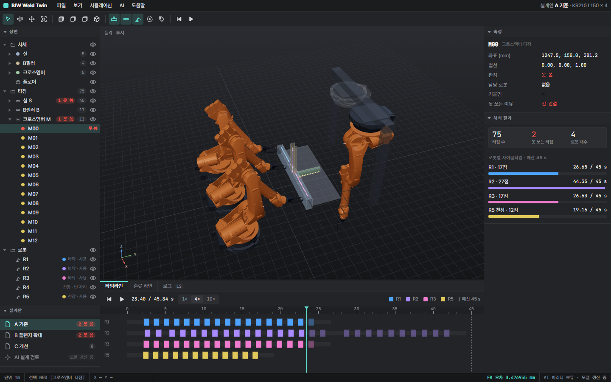
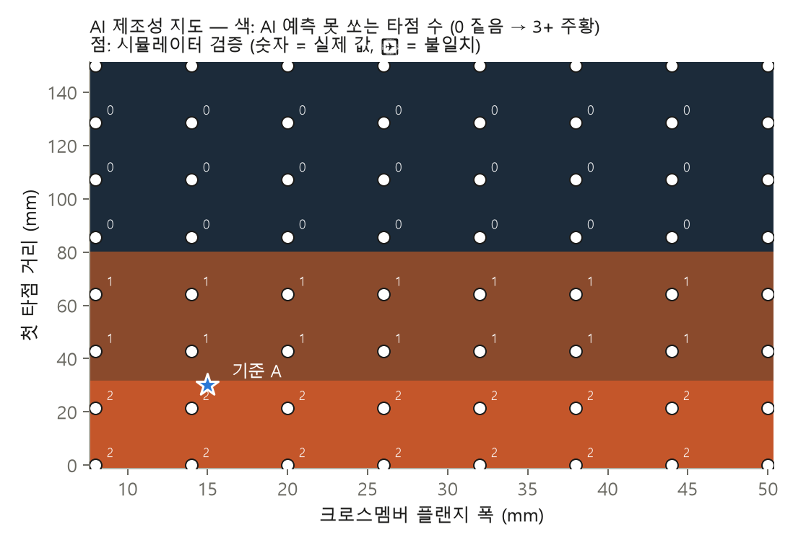

# 신차 투입 검토 — 차체 용접 디지털 트윈 + AI 제조성 판정

신차가 들어올 때 **차체 구조 → 용접 로봇 사양 → 라인 공법 → 투자비**를 데이터로 검토하는 CPS.
실제 로봇 기구학 위에서 시뮬레이터를 만들고, 그 시뮬레이터로 만든 설계 데이터로 **AI 제조성 판정 모델**을 학습해 설계 단계에서 바로 쓰게 했다.



| 단계 | 무엇 | 도구 |
|---|---|---|
| 1 선행구조 검토 | 차체 하위 조립품 스폿 타점 75개 × 로봇 후보 4곳 — 도달·관절 한계·용접건/팔 간섭·사이클타임 → 로봇 배정·대수 | KUKA KR210 L150 기구학(ROS-Industrial), 역기구학, CP-SAT |
| 2 AI 제조성 판정 | 설계 변형 2,400개(학습 2,000 · 시험 400)를 시뮬레이터로 만들어 학습 → 설계 변수만 보고 못 쏘는 타점 예측, 원인 설명, 설계 탐색 | LightGBM, SHAP |
| 3 혼류 투입 검토 | 기존 라인에 신차를 섞을 때 그대로 / 재밸런싱+증설 / 신규 라인 — 라인 정지·실제 JPH·5년 비용 | SALBP 벤치마크, CP-SAT, 라인 시뮬레이션 |
| 4 디지털 트윈 화면 | 로봇이 용접 순서대로 움직이는 3D, 설계안 비교, 혼류 라인 흐름, 슬라이더로 AI 즉시 판정 | three.js |
| 5 CAD 내보내기 | 설계안별 차체 STEP(부품 4 + 타점 75, 다시 읽어 검증) + 타점 목록 CSV(좌표·법선·판정·담당 로봇·이유) | CadQuery |

## 1. 선행구조 검토

| 설계안 | 못 쏘는 타점 | 로봇 (JPH 50~60) | 로봇 (JPH 65~75) | 로봇 (JPH 80) | 최대 로봇 사이클 (JPH 60, 예산 45 s) |
|---|---|---|---|---|---|
| A 기준 (플랜지 15 mm, 첫 타점 30 mm) | 1 | 2 | 3 | 4 | 43.7 s |
| B 플랜지만 30 mm | 1 | 2 | 3 | 4 | 44.1 s |
| C B + 첫 타점 80 mm | **0** | 2 | 3 | 4 | 45.0 s |

- 못 쏘던 타점 M00 은 네 로봇 모두 **건 간섭** — 크로스멤버 첫 타점이 실 안쪽 벽에 붙어 건 몸체가 실에 걸린다. 플랜지를 넓혀도 그대로다.
- 로봇 대수는 후보 위치 조합을 전부 시도하고, 조합마다 실제 용접 순서(관절 공간 최근접)로 사이클타임을 재서 정했다. 처음 쓴 "예산을 줄여 가며 재배정" 방식은 A 를 3대로 과대 산정했고, 전수 조합으로 2대가 맞음을 확인했다.

## 2. AI 제조성 판정

**데이터** — 설계 변수 9개(플랜지 폭, 크로스멤버 벽 높이·첫 타점·시작 위치·차 길이 방향 위치, B필러 위치·폭, 실 높이, 바닥 높이)를 무작위로 뽑아 시뮬레이터로 (타점 × 로봇) 판정을 모았다. 학습 2,000 설계(60만 쌍), 시험 400 설계(12만 쌍, 학습에 없던 설계). 시뮬레이터는 설계 1개에 4.2 s(코어 1개).

**시험 결과 (학습에 없던 400 설계)**

| 지표 | 좌표만 | **+ 공학 특징** |
|---|---|---|
| 못 쏘는 타점 재현율 | 96.3 % | **96.3 %** |
| 못 쏘는 타점 정밀도 | 69.7 % | **86.3 %** |
| 설계에 문제가 있는지 판정 | 92.3 % | **98.3 %** |
| 못 쏘는 타점 수까지 정확히 | 81.8 % | **90.5 %** |
| 설계 1개 판정 | | **0.03 s** (시뮬레이터 4.2 s) |

- 임계값은 검증 설계에서 "못 쏘는 타점을 95 % 이상 잡는" 쪽으로 정했다 — 놓치는 쪽이 더 비싸다.
- 공학 특징 = 로봇 어깨→건 뒤끝 경로와 B필러·실 사이 여유, 건 몸체와 실·벽 사이 여유 등 7개. 오경보가 크게 줄었다.
- **원인 설명(SHAP)** — 못 쏘는 판정을 민 특징 순서: 크로스멤버 타점인지 > 팔 경로와 B필러 여유 > 로봇까지 거리 > B필러와의 x 거리. 즉 문제는 "B필러 뒤 크로스멤버를 팔이 돌아 들어가는 자리"와 "실 옆 첫 타점"에 모인다.

**AI 로 설계 공간 탐색 → 시뮬레이터로 확정**



- 제조성 지도(플랜지 폭 × 첫 타점 거리, 3,600 점): 시뮬레이터 64 점과 **64/64 일치**. 결론 — 플랜지 폭은 무관, **첫 타점을 구간 시작에서 80 mm 이상(실 안쪽 면에서 120 mm 이상)** 두면 0.
- 경계 정밀 검사(첫 타점 0~150 mm, 5 mm 간격 31 점): 29/31 일치. 틀린 2 점(30 mm, 80 mm)은 모두 경계에서 **AI 가 더 나쁘게** 본 쪽 → AI 는 1차 선별, 경계 근처는 시뮬레이터로 확정하는 2단 구조로 쓴다.
- 설계 탐색: 기준 A 주변 20,000 안을 AI 로 8 분에 판정(시뮬레이터로는 9코어 약 3.5 시간) → 문제없음 3,414 안 → A 에서 가장 적게 바꾼 20 안을 시뮬레이터로 재검증 **20/20 통과**. 상위 안은 모두 첫 타점을 실에서 멀리 두는 방향이었다.

## 3. 혼류 투입 검토

기존 라인 = Scholl(1993) 벤치마크 ARC83(83작업), 목표 JPH 60, 신차 비율 30 %, 신차 작업시간 = 기존 × 로그정규(평균 1.15) [가정].

| 대안 | 스테이션 | 100대당 라인 정지 | 실제 JPH | 5년 비용 (상대) |
|---|---|---|---|---|
| A 그대로 혼류 (무작위 / 고르게) | 13 | 29.8 / 30.0 | 57.1 / 57.1 | 55.4 / 54.6 |
| B 재밸런싱 +1곳, 무작위 순서 | 14 | 18.1 | 59.3 | 36.1 |
| **B 재밸런싱 +1곳, 고르게 섞기** | 14 | **0** | **60.0** | **29.0** |
| C 신규 라인 (기존 9 + 신규 5) | 14 | 0 | 60.0 | 43.0 |


- 순서 규칙은 **재밸런싱 뒤에만** 효과가 있다. 기존 라인 효율 97 % 라 여유가 없어서 순서만 바꾼 A 는 그대로다.
- 신차 작업시간 가정을 10가지로 바꿔도 추천안 10/10 같음, 증설은 매번 1곳, 정지 0 (`results/stage2_seeds.json`).
- A 가 B 보다 싸려면 스테이션 1곳의 5년 비용이 못 만든 차 약 1.9만 대의 이익보다 커야 한다(A 는 5년에 약 5.7만 대를 잃는다).
- 1단계와 연결: 차체 A·B안은 못 쏘는 타점 때문에 수동 보완 공정이 붙어 32.0, C안은 29.0.

## 4. 디지털 트윈 화면

`open_viewer.cmd` 로 연다(정적 페이지, `viewer/` 를 로컬 서버로 띄움). CAD 도구 형태 — 메뉴·도구 막대, 장면 트리, 속성 창, 타임라인·혼류 라인·로그 도크, 상태 막대.


- 설계안 A/B/C: KUKA KR210 실제 외형 메시가 용접 순서대로 움직이고, 타점이 쏘이는 대로 켜진다. 못 쏘는 타점을 누르면 이유가 뜬다.
- 혼류 라인: 두 대안에 60대를 흘려 스테이션 지연·정지를 보여 준다.
- AI 설계 검토: 설계 변수 슬라이더 → 브라우저 안에서 AI 가 못 쏘는 타점을 즉시 표시.
- 화면의 로봇 자세는 파이썬 역기구학 결과를 그대로 재생하며, 전극 끝과 타점 좌표 차이는 최대 0.000004 mm 다.

## 무엇이 진짜고 무엇이 가정인가

| 진짜 (공개 자료) | 가정 |
|---|---|
| 로봇 기구학·관절 한계·속도·외형: ROS-Industrial `kuka_experimental` KR210 L150 (`data/robot/`) | 차체 형상(단순화한 실·B필러·크로스멤버)과 설계 변수 범위 |
| 기존 라인 작업·선후관계: Scholl(1993) SALBP ARC83 | 용접건 치수, 타점당 0.7 s, 이송·클램프 15 s, 가감속 보정 |
| 라인밸런싱 풀이기: 공개 최적해와 대조 | 신차 작업시간 배수, 여유창 20 %, 비용 단가(상대 단위) |

실제 완성차 공장 데이터는 쓰지 않았다. 가정은 `src/stage1.py`, `src/stage2.py`, `src/dataset.py` 맨 위에 모여 있다.

## 검증

- 라인밸런싱(CP-SAT): 공개 최적해 12문제 중 11 일치 (ARC83 4/4, Hahn 4/4, Warnecke 3/4 — c=56 은 30 s 제한에서 30, 최적 29)
- AI: 학습과 분리한 시험 설계 400개, 지도 64/64, 경계 31점 29/31, 탐색 20/20 시뮬레이터 재검증
- 3D 화면: 파이썬 역기구학과 좌표 일치(최대 오차 0.000004 mm)
- CAD: STEP 을 다시 읽어 솔리드 79개(부품 4 + 타점 75)·경계 2400×1013×1153 mm 확인
- `pytest tests` 13개 — 역기구학 도달/실패, 건 간섭, 기울여 피하기, 벤치마크 최적해, 정지 시뮬레이션 손계산, 로봇 조합 배정, AI 특징 순서, AI 판정 방향

## 돌리기

```
python -m venv .venv && .venv\Scripts\pip install -r requirements.txt
.venv\Scripts\python src\fetch_data.py   # SALBP 벤치마크 내려받기 (저장소에 넣지 않음)
cd src
..\.venv\Scripts\python stage1.py          # 설계안 A/B/C, JPH 별 로봇 대수
..\.venv\Scripts\python stage2.py          # 혼류 대안
..\.venv\Scripts\python dataset.py 2000 9 0 && ..\.venv\Scripts\python dataset.py 400 9 1   # 약 20분
..\.venv\Scripts\python surrogate.py       # AI 학습·시험
..\.venv\Scripts\python explore.py         # 제조성 지도·설계 탐색·재검증 (약 10분)
..\.venv\Scripts\python export_twin.py && ..\.venv\Scripts\python export_cad.py && ..\.venv\Scripts\python figures.py
```

## 출처

외부 자료와 라이선스는 `NOTICE.md`. 코드는 MIT.

## 한계

- 로봇끼리의 간섭, 지그·클램프 형상, 로봇 경로 중간의 간섭은 보지 않는다(타점 자세에서만 판정).
- 사이클타임은 관절 최대속도 × 가감속 보정의 근사다.
- 차체는 하위 조립품 하나를 단순화한 것이다. AI 는 이 설계 공간 안에서만 검증됐다.
- 비용은 상대 단위다. 결론은 "어느 단가에서 뒤집히는가"로 읽는다.
